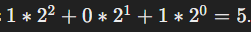
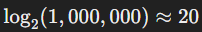

Introduction
This note covers the introductory lecture of Harvard's CS50 course, focusing on the fundamentals of computer science and programming. It introduces key concepts such as binary representation, algorithms, and the importance of efficient problem-solving. The lecture also highlights the practical applications of computer science across various fields.

Index
Introduction to CS50
Importance of Computer Science
Drinking from a Fire Hose Metaphor
Course Structure and Languages Covered
Problem Solving and Computational Thinking
Representation of Information
Binary and Unary Systems
Bits and Bytes
ASCII and Unicode
Representation of Colors
Representation of Sound and Video
Algorithms and Problem Solving
Efficiency in Algorithms
Body
1. Introduction to CS50
Summary: The lecture begins with an introduction to CS50, Harvard's introductory course in computer science and programming.
Explanation: CS50 is designed to introduce students to the intellectual enterprises of computer science and the art of programming. It is intended for both students with prior programming experience and those who have never programmed before. The course aims to teach problem-solving, algorithmic thinking, and foundational programming skills that are applicable across many disciplines. David J. Malan, the course instructor, emphasizes that CS50 is about learning how to think computationally and how to tackle complex problems methodically.

2. Importance of Computer Science
Summary: Computer science is a versatile field that applies to many other disciplines.
Explanation: Malan highlights that computer science is not just about programming but about developing a general-purpose way of thinking that can be applied to various fields such as arts, humanities, social sciences, natural sciences, and STEM disciplines. The skills learned in CS50, even if it is the only computer science course a student takes, are broadly applicable. Understanding how to solve problems computationally and how to use programming as a tool can benefit students in numerous ways, regardless of their primary field of study.

3. Drinking from a Fire Hose Metaphor
Summary: The metaphor illustrates the overwhelming amount of information students will encounter.
Explanation: Malan uses the metaphor of "drinking from a fire hose" to describe the intense and fast-paced nature of CS50. Students will be exposed to a large volume of new information, concepts, and skills. He reassures them that it is normal to feel overwhelmed, especially in the beginning. The course is designed to challenge students and push them out of their comfort zones, but with practice and time, they will become more comfortable and proficient in the material. The goal is for students to embrace the discomfort as part of the learning process.

4. Course Structure and Languages Covered
Summary: The course covers multiple programming languages and tools.
Explanation: CS50 introduces students to several programming languages, each chosen for its particular strengths and relevance. The course starts with C, a foundational language that teaches low-level programming concepts and memory management. Students then learn Python, a high-level language popular for its simplicity and versatility in data science, web development, and more. SQL is introduced for database management, providing students with tools to handle and query large datasets. Toward the end of the semester, students learn JavaScript, along with HTML and CSS, to develop web applications. This multi-language approach equips students with a diverse skill set and the confidence to learn new languages independently after the course.

5. Problem Solving and Computational Thinking
Summary: The course focuses on developing problem-solving skills through computational thinking.
Explanation: Computational thinking involves breaking down complex problems into manageable parts and solving them systematically. This way of thinking is central to computer science and is applicable beyond programming. CS50 teaches students how to approach problems methodically, using algorithms and data structures to design efficient solutions. By the end of the course, students will have a toolkit of computational techniques that they can apply to various types of problems, whether in computer science or other fields.

6. Representation of Information
Summary: Representing information in computers involves converting data into a format that computers can process.
Explanation: Computers process data using binary systems, where information is represented using combinations of 0s and 1s. This includes representing numbers, letters, colors, images, videos, and sounds. For example, the number 65 in binary is used to represent the letter 'A' in the ASCII system. Understanding how different types of data are represented in binary form is fundamental to understanding how computers work and how to program them effectively.

7. Binary and Unary Systems
Summary: Binary and unary systems are ways to represent numbers using different bases.
Explanation:

Unary System: In the unary system (base-1), numbers are represented by repeating a single digit. For example, the number 5 is represented by five instances of the digit 1 (e.g., 11111). This system is simple but not efficient for representing large numbers due to its redundancy.
Binary System: The binary system (base-2) uses two digits, 0 and 1, to represent numbers. Each binary digit is called a bit. Binary is more efficient than unary because it uses positional value, where each position represents a power of 2. For example, the binary number 101 represents  Binary is the fundamental language of computers, as it directly maps to the electrical states of circuits (on/off).
8. Bits and Bytes
Summary: Bits and bytes are the basic units of data in computing.
Explanation:

Bits: A bit is the smallest unit of data in a computer and can have a value of either 0 or 1. It represents a binary digit.
Bytes: A byte consists of 8 bits. This combination can represent 256 different values (from 0 to 255). Bytes are used as a standard unit for data storage and processing. For example, the ASCII code for the letter 'A' is 65, which in binary is represented by the byte 01000001.
Usage: Bits and bytes are foundational for data storage, memory addressing, and processing instructions in all digital devices. Understanding their role is crucial for grasping how computers handle information.
9. ASCII and Unicode
Summary: ASCII and Unicode are standards for representing text in computers.
Explanation:

ASCII: The American Standard Code for Information Interchange (ASCII) is a character encoding standard that uses 7 or 8 bits to represent English characters, digits, and some symbols. For example, the ASCII code for the letter 'A' is 65.
Unicode: Unicode extends ASCII to support a much larger set of characters, allowing for global language representation. Unicode can use up to 32 bits per character, providing over 4 billion possible combinations. This is essential for representing characters from many languages, including emojis and special symbols.
Benefits: Unicode ensures that text data can be consistently represented and interpreted across different platforms and devices, making it a universal standard for text representation.
10. Representation of Colors
Summary: Colors are represented using the RGB model.
Explanation:

RGB Model: The RGB (Red, Green, Blue) model represents colors by combining different intensities of red, green, and blue light. Each color component is typically represented by a byte (8 bits), allowing for 256 different levels of intensity for each color.
Combining Colors: By mixing different levels of red, green, and blue, a wide range of colors can be produced. For instance, the color yellow can be created by combining a high intensity of red and green with no blue.
Usage in Displays: Digital displays use the RGB model where each pixel is composed of red, green, and blue subpixels. The color of each pixel is determined by the combination of these subpixels' intensities, which are controlled by their respective bytes.
11. Representation of Sound and Video
Summary: Sound and video are represented using numerical values for different attributes.
Explanation:

Sound: Digital sound representation involves sampling the audio signal at regular intervals and converting each sample into a numerical value. These values represent the amplitude of the sound wave at each point in time. Additional attributes such as pitch, duration, and volume can also be encoded. For example, a sound's pitch can be represented by the frequency of the samples, and its volume by the amplitude.
Video: Video is represented as a sequence of still images (frames) displayed rapidly in succession. Each frame is a complete image, and when played back at a standard rate (e.g., 30 frames per second), it creates the illusion of motion. Video files combine these frames with synchronized audio to create moving pictures with sound.
Compression: Both sound and video data are often compressed to reduce file size while maintaining quality, using various codecs and algorithms.
12. Algorithms and Problem Solving
Summary: Algorithms are step-by-step instructions for solving problems.
Explanation:

Definition: An algorithm is a precise, step-by-step procedure for solving a problem or performing a task. In computer science, algorithms are implemented in code to automate tasks and process data.
Examples: The lecture introduces basic algorithms such as searching and sorting. For instance, a linear search algorithm checks each entry sequentially until it finds the target value, while a binary search algorithm repeatedly divides a sorted list in half to quickly locate the target value.
Importance: Designing correct and efficient algorithms is crucial for solving problems effectively. Algorithms form the backbone of all computer programs and are essential for tasks ranging from simple data processing to complex machine learning models.
13. Efficiency in Algorithms
Summary: Efficient algorithms are crucial for handling large datasets and complex problems.
Explanation:

Efficiency Measurement: The efficiency of an algorithm is typically measured by its time complexity (how the execution time grows with the input size) and space complexity (how the memory usage grows with the input size).
Examples:
Linear Search: Has a time complexity of O(n), meaning the time required grows linearly with the size of the input.
Binary Search: Has a time complexity of O(log n), making it significantly faster for large inputs because it repeatedly divides the input size in half.
Importance: Efficient algorithms are essential for applications that process large amounts of data or require real-time performance, such as web search engines, data analysis tools, and financial trading systems. Understanding and designing efficient algorithms enable developers to build scalable and high-performing applications.


Summary
Introduction to CS50: The course aims to teach computer science fundamentals, emphasizing problem-solving and practical applications.
Importance of Computer Science: Computer science skills are widely applicable across various disciplines.
Drinking from a Fire Hose Metaphor: The overwhelming information load is normal, and students will become more comfortable over time.
Course Structure and Languages Covered: The course covers C, Python, SQL, JavaScript, HTML, and CSS, aiming to equip students with the ability to learn new languages independently.
Problem Solving and Computational Thinking: Computational thinking involves methodically applying ideas to solve problems, applicable in various fields.
Representation of Information: Information is converted into formats that computers can process, including numbers, letters, colors, images, videos, and sounds.
Binary and Unary Systems: Binary (base-2) and unary (base-1) are systems to represent numbers.
Bits and Bytes: Bits and bytes are basic data units, with a bit being a binary digit and a byte consisting of 8 bits.
ASCII and Unicode: ASCII and Unicode are text representation standards, with Unicode supporting a wider range of characters.
Representation of Colors: Colors are represented using the RGB model, with values for red, green, and blue.
Representation of Sound and Video: Sound is represented by pitch, duration, and volume, while video is a sequence of images.
Algorithms and Problem Solving: Algorithms are crucial for efficient problem-solving and are implemented in code.
Efficiency in Algorithms: Efficient algorithms are important for handling large datasets and complex problems.


## Binary Search: An Efficient Search Algorithm

Summary: Binary search is an algorithm that finds the position of a target value within a sorted array. It has a time complexity of O(log n), making it significantly faster for large inputs compared to linear search, which has a time complexity of O(n).

Explanation:
Binary search works by repeatedly dividing the search interval in half. If the target value is less than the middle element of the interval, the algorithm narrows the interval to the lower half. Otherwise, it narrows it to the upper half. This process continues until the target value is found or the interval is empty.

Steps of Binary Search:

1. Initial Setup: Start with the entire array as the search interval.
2. Find Middle Element: Calculate the middle element of the current interval.
3. Compare and Narrow Down:
  - If the target value is equal to the middle element, the search is successful, and the index of the middle element is returned.
  - If the target value is less than the middle element, adjust the search interval to the lower half.
  - If the target value is greater than the middle element, adjust the search interval to the upper half.
4. Repeat: Repeat steps 2 and 3 with the new search interval until the target value is found or the interval is empty.
5. End Condition: If the interval becomes empty, the target value is not in the array.

Example:

Let's walk through an example to illustrate binary search.

Suppose we have a sorted array:
arr = [ 2, 3,5,7,11,13,17,19,23,29]
arr=[2,3,5,7,11,13,17,19,23,29]
We want to find the position of the target value 17.

  1. Initial Setup:

    - Search interval: [0,9]
    - Array: [2,3,5,7,11,13,17,19,23,29]
    - Target value: 17

  2. First Iteration:

    - Middle index: ⌊0+9/2⌋=4
    - Middle element: arr[4]=11
    - Compare: 17>11
    - Adjust interval to the upper half: [5,9]

  3. Second Iteration:

    - Middle index: ⌊5+9/2⌋=7
    - Middle element: arr[7]=19
    - Compare:  17<19
    - Adjust interval to the lower half: [5,6]

  4. Third Iteration:

    - Middle index: ⌊5+6/2⌋=5
    - Middle element: arr[5]=13
    - Compare: 17>13
    - Adjust interval to the upper half: [6,6]

  5. Fourth Iteration:

    - Middle index: ⌊6+6/2⌋=6
    - Middle element: arr[6]=17
    - Compare: 17=17
    - Target found at index 6

Time Complexity Analysis:

  - Logarithmic Growth: The time complexity of binary search is O(log n) because the size of the search interval is halved with each iteration. In the worst case, the number of iterations required to find the target value is the logarithm of the input size 𝑛 to the base 2, which grows much more slowly than linear time (O(n)).
  
  - Example with Large Inputs: For an array of size 1,000,000, binary search would take at most  iterations, whereas linear search might take up to 1,000,000 iterations.

Visualization of Binary Search:

Consider an array [1,2,3,4,5,6,7,8,9,10] and we want to find the target value 6.

```javascript
Iteration 1:
Array:        [1, 2, 3, 4, 5, 6, 7, 8, 9, 10]
Indices:       0  1  2  3  4  5  6  7  8  9
Middle Index: (0+9)/2 = 4
Middle Value: 5 (Target is greater, search right half)

Iteration 2:
Array:        [6, 7, 8, 9, 10]
Indices:       5  6  7  8  9
Middle Index: (5+9)/2 = 7
Middle Value: 8 (Target is less, search left half)

Iteration 3:
Array:        [6, 7]
Indices:       5  6
Middle Index: (5+6)/2 = 5
Middle Value: 6 (Target found)

```
Binary search efficiently narrows down the search range, making it highly effective for large datasets, provided the data is sorted.