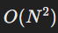

## Introduction

This note covers the key concepts discussed in CS50's third section, including algorithms, structures (structs), and recursion. These concepts are essential for understanding how to approach problem-solving in computer science, particularly in terms of data searching, sorting, and defining custom data types.

## Index
1. Comparing Algorithms
2. Understanding and Implementing Structs
3. Basics of Recursion
4. Practical Application and Code Examples

## 1. Comparing Algorithms

### Definition

Comparing algorithms involves evaluating their efficiency and performance, particularly in terms of time complexity. This helps in determining the most suitable algorithm for a given problem.

### Explanation

Algorithms can be compared using various notations such as Big O, Big Omega, and Big Theta. These notations help in understanding the worst-case, best-case, and average-case scenarios of algorithm performance.

- Linear Search: Checks each element sequentially. Worst-case time complexity is O(N).
- Binary Search: Divides the search interval in half each time. Requires sorted data. Worst-case time complexity is O(logN).

Code Example

```javascript
// Linear Search Example
int linear_search(int arr[], int size, int target) {
    for (int i = 0; i < size; i++) {
        if (arr[i] == target) {
            return i;
        }
    }
    return -1;
}

// Binary Search Example
int binary_search(int arr[], int size, int target) {
    int low = 0, high = size - 1;
    while (low <= high) {
        int mid = (low + high) / 2;
        if (arr[mid] == target) {
            return mid;
        } else if (arr[mid] < target) {
            low = mid + 1;
        } else {
            high = mid - 1;
        }
    }
    return -1;
}
```
### Additional Explanations

1. Bubble Sort: Simple sorting algorithm with  complexity in the worst case.
2. Merge Sort: More efficient sorting algorithm with O(NlogN) complexity.

### Additional Examples

```javascript
// Bubble Sort Example
void bubble_sort(int arr[], int size) {
    for (int i = 0; i < size - 1; i++) {
        for (int j = 0; j < size - i - 1; j++) {
            if (arr[j] > arr[j + 1]) {
                int temp = arr[j];
                arr[j] = arr[j + 1];
                arr[j + 1] = temp;
            }
        }
    }
}

// Merge Sort Example
void merge(int arr[], int l, int m, int r) {
    int n1 = m - l + 1;
    int n2 = r - m;
    int L[n1], R[n2];
    for (int i = 0; i < n1; i++) L[i] = arr[l + i];
    for (int j = 0; j < n2; j++) R[j] = arr[m + 1 + j];
    int i = 0, j = 0, k = l;
    while (i < n1 && j < n2) {
        if (L[i] <= R[j]) arr[k++] = L[i++];
        else arr[k++] = R[j++];
    }
    while (i < n1) arr[k++] = L[i++];
    while (j < n2) arr[k++] = R[j++];
}

void merge_sort(int arr[], int l, int r) {
    if (l < r) {
        int m = l + (r - l) / 2;
        merge_sort(arr, l, m);
        merge_sort(arr, m + 1, r);
        merge(arr, l, m, r);
    }
}
```

## 2. Understanding and Implementing Structs

### Definition
A `struct` (structure) in C allows grouping variables of different types under a single name. It is used to create complex data types that encapsulate multiple properties.

### Explanation
Structs are useful for organizing related data and making code more readable and maintainable. For example, a struct can represent a `candidate` with a name and vote count.

A `struct` is a composite data type that groups variables of different types. It allows for the organization of complex data into a single entity, making the code more manageable and intuitive.

To define a `struct`, use the following syntax:

```javascript
typedef struct {
    dataType member1;
    dataType member2;
    ...
} structName;
```

- `typedef struct { ... }` creates a new data type.
- `structName` is the name of the new data type.
- `dataType member1` is a variable of type `dataType`.
For example, to define a `struct` for a `Candidate`

```javascript
typedef struct {
    char name[50];
    int votes;
} Candidate;
```

To declare a variable of type `Candidate`:

```javascript
Candidate candidate1;
```

You can access and modify the members of a struct using the dot operator:

```javascript
strcpy(candidate1.name, "Alice");
candidate1.votes = 100;
```

Structs can also be nested, allowing for even more complex data structures:

```javascript
typedef struct {
    int day;
    int month;
    int year;
} Date;

typedef struct {
    char name[50];
    Date birthdate;
} Person;
```
### Code Example

```javascript
typedef struct {
    char name[50];
    int votes;
} Candidate;

// Creating and using a struct
Candidate president;
strcpy(president.name, "Alice");
president.votes = 100;
```

### Additional Explanations
1. Nested Structs: Structs can contain other structs to represent more complex data.
2. Array of Structs: Useful for handling multiple entities of the same type.

### Additional Examples

```javascript
// Nested Struct Example
typedef struct {
    int day;
    int month;
    int year;
} Date;

typedef struct {
    char name[50];
    Date birthdate;
} Person;

// Array of Structs Example
Candidate candidates[3];
strcpy(candidates[0].name, "Bob");
candidates[0].votes = 200;
```

## 3. Basics of Recursion

### Definition
Recursion is a programming technique where a function calls itself to solve a problem by breaking it down into smaller sub-problems.

### Explanation
Recursion is often used for problems that have a clear base case and can be defined in terms of smaller instances of the same problem. Examples include calculating factorials, Fibonacci sequences, and tree traversals.

A recursive function generally consists of two parts:

1. Base Case: The condition under which the function stops calling itself.
2. Recursive Case: The part of the function where the problem is divided into smaller instances and the function calls itself.

For example, the factorial of a number can be defined recursively:

- Base Case: n!=1 when n=1
Recursive Case: n!=n×(n−1)!

```javascript
// Factorial using Recursion
int factorial(int n) {
    if (n == 1) return 1;
    return n * factorial(n - 1);
}
```

### Additional Explanations

1. Base Case: The condition under which the recursive function stops calling itself.
2. Recursive Case: The part of the function that breaks the problem into smaller instances and calls itself.

### Additional Examples

```javascript
// Fibonacci using Recursion
int fibonacci(int n) {
    if (n == 0) return 0;
    if (n == 1) return 1;
    return fibonacci(n - 1) + fibonacci(n - 2);
}

// Recursive Binary Search
int recursive_binary_search(int arr[], int low, int high, int target) {
    if (low > high) return -1;
    int mid = (low + high) / 2;
    if (arr[mid] == target) return mid;
    if (arr[mid] < target) return recursive_binary_search(arr, mid + 1, high, target);
    return recursive_binary_search(arr, low, mid - 1, target);
}
```

## 4. Practical Application and Code Examples

### Applying Structs
Structs can be used to handle more complex data structures, such as arrays of structs or nested structs.

### Example Code

```javascript
#include <stdio.h>
#include <string.h>

// Define struct Candidate
typedef struct {
    char name[50];
    int votes;
} Candidate;

// Main function
int main() {
    // Declare an array of candidates
    Candidate candidates[3];
    
    // Initialize candidates
    strcpy(candidates[0].name, "Alice");
    candidates[0].votes = 100;
    
    strcpy(candidates[1].name, "Bob");
    candidates[1].votes = 200;
    
    strcpy(candidates[2].name, "Charlie");
    candidates[2].votes = 150;
    
    // Find the candidate with the most votes
    int maxVotes = 0;
    char winner[50];
    
    for (int i = 0; i < 3; i++) {
        if (candidates[i].votes > maxVotes) {
            maxVotes = candidates[i].votes;
            strcpy(winner, candidates[i].name);
        }
    }
    
    printf("The winner is %s with %d votes.\n", winner, maxVotes);
    
    return 0;
}
```

### Applying Recursion

Recursion is useful for problems that can be broken down into smaller sub-problems with a clear base case.

### Example Code

```javascript
#include <stdio.h>

// Recursive function to calculate factorial
int factorial(int n) {
    if (n == 1) return 1; // Base case
    return n * factorial(n - 1); // Recursive case
}

// Main function
int main() {
    int number = 5;
    printf("Factorial of %d is %d\n", number, factorial(number));
    return 0;
}
```
## Summary
1. Comparing Algorithms: Understand and compare different algorithms based on their time complexity and performance using Big O and Big Omega notations.
2. Understanding and Implementing Structs: Use structs to create complex data types and manage related data more effectively in C.
3. Basics of Recursion: Apply recursive techniques to solve problems by breaking them into smaller sub-problems and defining clear base cases.