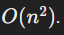

## Merge Sort and Insertion Sort

In this note, we will delve into two sorting algorithms: Merge Sort and Insertion Sort. Both have unique characteristics and use cases. Merge Sort is a more advanced, efficient algorithm, while Insertion Sort is simpler and more intuitive. We will explore each algorithm in detail, providing explanations and examples.

## Index
1. Insertion Sort
2. Merge Sort

## Insertion Sort

### Definition:

Insertion Sort is a comparison-based sorting algorithm that builds the final sorted array one item at a time. It is more efficient for small datasets and lists that are already mostly sorted.

### Explanation:

Insertion Sort works by iterating through the list and removing one element at a time, inserting it into its correct position within the sorted part of the list. The algorithm maintains a sublist that is always sorted and grows this sublist with each iteration by inserting the next element into its proper place.

### Steps:
1. Start with the second element in the list.
2. Compare this element with the elements in the sorted sublist (initially just the first element).
3. Shift all elements greater than the current element to the right.
4. Insert the current element into its correct position.
5. Repeat until the entire list is sorted.

### Insertion Sort: Step-by-Step Execution

Example

Consider the array: `[12, 11, 13, 5, 6]`

Initial Array:
`[12, 11, 13, 5, 6]`

### Step-by-Step Execution:

1. First Pass (i = 1):
  - Key = 11
  - Compare key with elements in the sorted sublist (initially just the first element):
    - Compare 11 with 12:
      - 11 < 12, so shift 12 to the right.
    - Insert 11 into its correct position.
    - Array now: [11, 12, 13, 5, 6]
2. Second Pass (i = 2):
  - Key = 13
  - Compare key with elements in the sorted sublist:
    - Compare 13 with 12:
      - 13 > 12, so no shifting needed.
  - Insert 13 into its correct position.
  - Array now: [11, 12, 13, 5, 6]
3. Third Pass (i = 3):
  - Key = 5
  - Compare key with elements in the sorted sublist:
    - Compare 5 with 13:
      - 5 < 13, so shift 13 to the right.
    - Compare 5 with 12:
      - 5 < 12, so shift 12 to the right.
    - Compare 5 with 11:
      - 5 < 11, so shift 11 to the right.
  - Insert 5 into its correct position.
  - Array now: [5, 11, 12, 13, 6]
4. Fourth Pass (i = 4):
  - Key = 6
  - Compare key with elements in the sorted sublist:
    - Compare 6 with 13:
      - 6 < 13, so shift 13 to the right.
    - Compare 6 with 12:
      - 6 < 12, so shift 12 to the right.
    - Compare 6 with 11:
      - 6 < 11, so shift 11 to the right.
  - Insert 6 into its correct position.
  - Array now: [5, 6, 11, 12, 13]

Sorted Array:
`[5, 6, 11, 12, 13]`

### Code 
```javascript
def insertion_sort(arr):
    for i in range(1, len(arr)):
        key = arr[i]
        j = i - 1
        while j >= 0 and key < arr[j]:
            arr[j + 1] = arr[j]
            j -= 1
        arr[j + 1] = key
    return arr

print(insertion_sort([12, 11, 13, 5, 6]))
```

### Additional Explanations:

1. Best-Case Scenario: The list is already sorted, resulting in a time complexity of O(n).
2. Worst-Case Scenario: The list is sorted in reverse order, resulting in a time complexity of 

### Additional Examples:

1. Sorting a list of student grades:
```javascript
grades = [85, 92, 78, 88, 90]
print(insertion_sort(grades))
```
2. Sorting a deck of cards by rank:
```javascript
cards = [3, 1, 4, 2, 5]
print(insertion_sort(cards))
```

## Merge Sort

### Definition:

Merge Sort is a divide-and-conquer algorithm that divides the unsorted list into n sublists, each containing one element, and then repeatedly merges sublists to produce new sorted sublists until only one sublist remains.

### Explanation:

Merge Sort works by recursively splitting the list into smaller sublists until each sublist contains only one element. Then, it merges these sublists in a sorted manner to produce larger sorted sublists until the entire list is sorted.

### Steps:
1. Divide the list into two halves.
2. Recursively sort each half.
3. Merge the sorted halves to produce the final sorted list.

### Example

Consider the array: `[12, 11, 13, 5, 6, 7]`

Initial Array: `[12, 11, 13, 5, 6, 7]`

### Step-by-Step Execution:

1. Divide the Array:
  - Split into two halves: `[12, 11, 13]` and `[5, 6, 7]`
2. Recursively Sort the Left Half `[12, 11, 13]`:
- Split into `[12]` and `[11, 13]`
- `[12]` is already sorted.
- Recursively sort `[11, 13]`:
  - Split into `[11]` and `[13]`
  - `[11]` and `[13]` are already sorted.
  - Merge `[11]` and `[13]` to get `[11, 13]`
- Merge [12] and `[11, 13]`:
  - Compare 12 and 11: 11 is smaller.
  - Compare 12 and 13: 12 is smaller.
  - Remaining 13 is added.
- Resulting sorted left half: `[11, 12, 13]`
3. Recursively Sort the Right Half `[5, 6, 7]`:
- Split into `[5]` and `[6, 7]`
- `[5]` is already sorted.
- Recursively sort `[6, 7]`:
  - Split into `[6]` and `[7]`
  - `[6]` and `[7]` are already sorted.
  - Merge `[6]` and `[7]` to get `[6, 7]`
- Merge `[5]` and `[6, 7]`:
  - Compare 5 and 6: 5 is smaller.
  - Remaining 6 and 7 are added.
- Resulting sorted right half: `[5, 6, 7]`
4. Merge the Sorted Halves [11, 12, 13] and `[5, 6, 7]`:
- Compare 11 and 5: 5 is smaller.
- Compare 11 and 6: 6 is smaller.
- Compare 11 and 7: 7 is smaller.
- Remaining 11, 12, and 13 are added.
- Resulting sorted array: `[5, 6, 7, 11, 12, 13]`
Sorted Array:
`[5, 6, 7, 11, 12, 13]`

### Code
```javascript
def merge_sort(arr):
    if len(arr) > 1:
        mid = len(arr) // 2
        left_half = arr[:mid]
        right_half = arr[mid:]

        merge_sort(left_half)
        merge_sort(right_half)

        i = j = k = 0

        while i < len(left_half) and j < len(right_half):
            if left_half[i] < right_half[j]:
                arr[k] = left_half[i]
                i += 1
            else:
                arr[k] = right_half[j]
                j += 1
            k += 1

        while i < len(left_half):
            arr[k] = left_half[i]
            i += 1
            k += 1

        while j < len(right_half):
            arr[k] = right_half[j]
            j += 1
            k += 1

    return arr

print(merge_sort([12, 11, 13, 5, 6, 7]))
```

### Additional Explanations:

1. Time Complexity: Merge Sort has a time complexity of O(nlogn) in all cases, making it more efficient than simple sorts for large datasets.
2. Stability: Merge Sort is stable, meaning it preserves the relative order of equal elements.

### Additional Examples:

1. Sorting a list of words by length:
```javascript
words = ["apple", "banana", "cherry", "date"]
print(merge_sort(words))
```
2. Sorting a list of timestamps:
```javascript
timestamps = ["2024-08-01 12:00", "2024-08-01 10:00", "2024-08-01 11:00"]
print(merge_sort(timestamps))
```

## Summary

In this note, we covered two sorting algorithms and their characteristics:

1. Insertion Sort: Builds the sorted array one item at a time by inserting elements into their correct position, with a best-case time complexity of O(n). Efficient for small datasets and nearly sorted lists.
2. Merge Sort: Divides the list into smaller sublists and merges them in sorted order, with a time complexity of O(nlogn). Efficient for large datasets and stable.

These algorithms provide different tools for sorting data, each with its strengths and appropriate use cases.

